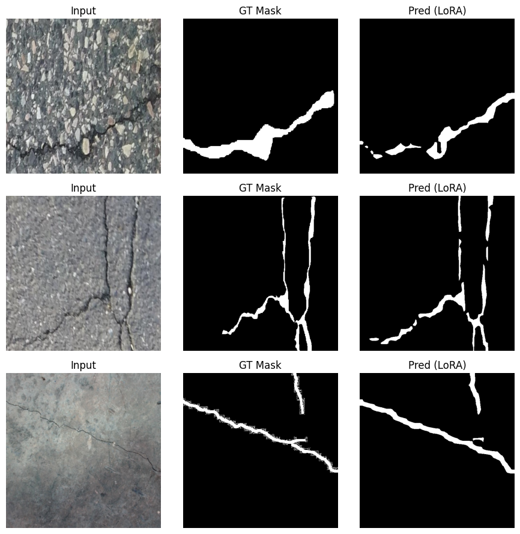

# Fine-Tuning SAM2 with LoRA for Infrastructure Crack Segmentation

This project demonstrates a parameter-efficient fine-tuning (PEFT) approach to adapt Meta's Segment Anything Model 2 (SAM2) for a specialized computer vision task: infrastructure crack segmentation.

Using a frozen SAM2 backbone, a custom segmentation head, and **Low-Rank Adaptation (LoRA)**, this method achieves a **10.8% relative improvement in Dice Score** over the baseline, proving its effectiveness for adapting foundation models to niche domains.

**Jupyter Notebook:** `Using_SAM2_+_LoRA_on_Crack_Segmentation_Dataset.ipynb`

---

## 1. Project Overview

* **Problem:** Foundation models like SAM2 are powerful generalists but perform poorly on specific, out-of-distribution tasks like pavement crack segmentation. Full fine-tuning is computationally expensive and requires vast datasets.
* **Solution:** Apply a PEFT technique (LoRA) to adapt the SAM2 model.
* **Methodology:**
    1.  **Freeze** the pre-trained SAM2 (`sam2_hiera_tiny`) image encoder.
    2.  **Add a custom, lightweight segmentation head** to the encoder's feature pyramid network (FPN). This is the "Baseline" model.
    3.  **Attach LoRA adapters** to the encoder's linear layers. This is the "LoRA" model.
    4.  **Train *only* the LoRA adapters and the custom head** on the crack dataset, using a `monai.losses.DiceLoss`.

This approach adapts the model's feature extraction (via LoRA) and task-specific output (via the head) with minimal computation, high efficiency, and no risk of catastrophic forgetting.

## 2. Dataset

This model was trained on the **[Crack Segmentation Dataset](https://www.kaggle.com/datasets/anshulmehtakaggle/crack-segmentation-dataset)** from Kaggle.
* **Content:** Images of pavement with corresponding binary segmentation masks.
* **Purpose:** Ideal for testing model adaptation for infrastructure inspection and maintenance.

## 3. Key Results

The primary goal was to measure the performance gain from using LoRA. Based on the test set evaluation, the LoRA-enhanced model demonstrated a clear improvement over the baseline (training only the custom head).

| Model | Dice Score | Mean IoU | Recall | Precision |
| :--- | :--- | :--- | :--- | :--- |
| Baseline (Head Only) | 0.636 | 0.467 | 0.581 | 0.703 |
| **Ours (LoRA + Head)** | **0.705** | **0.545** | **0.683** | **0.729** |
| **Improvement** | **+10.8%** | **+16.7%** | **+17.5%** | **+3.7%** |

*(Metrics are rounded from the notebook output for clarity)*

The LoRA-tuned model is significantly better at **finding** the cracks (higher recall) and more **accurate** when it does (higher precision), resulting in a much better overall fit (higher Dice/IoU).

### Sample Predictions

**


## 4. How to Run

1.  **Clone the repository:**
    ```bash
    git clone [https://github.com/Yungkeshy/SAM2-LoRA-Crack-Segmentation.git](https://github.com/Yungkeshy/SAM2-LoRA-Crack-Segmentation.git)
    cd SAM2-LoRA-Crack-Segmentation
    ```

2.  **Install dependencies:**
    A `requirements.txt` file is included.
    ```bash
    pip install -r requirements.txt
    ```

3.  **Download the Dataset:**
    This project uses the Kaggle API. Ensure you have your `kaggle.json` API key in `~/.kaggle/`.
    ```bash
    kaggle datasets download -d anshulmehtakaggle/crack-segmentation-dataset
    unzip crack-segmentation-dataset.zip -d data
    ```
    *(This assumes you have a `data` folder, as specified in the `.gitignore`)*

4.  **Run the Notebook:**
    Open and run the `Using_SAM2_+_LoRA_on_Crack_Segmentation_Dataset.ipynb` notebook in a Jupyter or VS Code environment.
